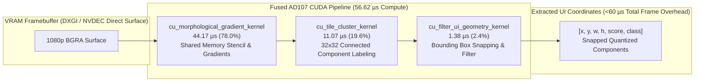
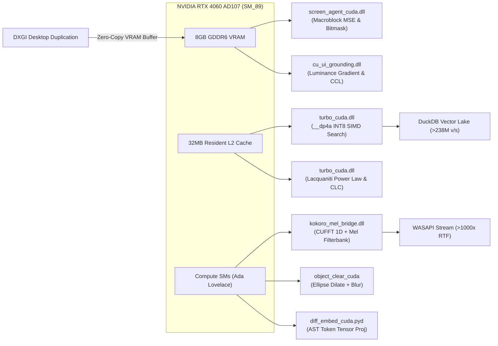

<p align="center">
  
</p>

# John Dondlinger
### Staff Edge & Systems Architect | Low-Latency GPU Kernel Engineer | Distributed Edge Infrastructure

<p align="center">
  
</p>

<p align="center">
  <a href="https://developer.nvidia.com/cuda-zone"></a>
  <a href="https://duckdb.org/"></a>
  <a href="https://dotnet.microsoft.com/"></a>
  <a href="https://workers.cloudflare.com/"></a>
  <a href="https://www.rust-lang.org/"></a>
  <a href="https://www.faa.gov/uas"></a>
</p>

---

```
  ┌──────────────────────────────────────────────────────────────────────────────────────────────┐
  │  HOST TOPOLOGY: Acer Predator Helios Neo 16                                                  │
  │  GPU: NVIDIA GeForce RTX 4060 Laptop (AD107 / SM_89, 8GB GDDR6, 32MB L2 Cache)               │
  │  HOST MEMORY: 16GB DDR5  •  KERNEL DISPATCH: Direct C-ABI (ctypes / CUDA 12.6)               │
  │  ZERO-COPY VRAM PIPELINE: DXGI Desktop Duplication ──> AD107 VRAM ──> L2 Cache (<50 ns)      │
  └──────────────────────────────────────────────────────────────────────────────────────────────┘
```

---

> *"Engineering at the physical silicon boundary: eliminating Python runtime garbage collection, PyTorch memory allocation bloat, and CPU frame roundtrips through standalone, zero-dependency C++/CUDA kernels, in-process analytical engines, and zero-liability distributed edge systems."*

---

## ⚡ Executive Engineering Profile

Staff-level Systems Architect and Autonomous Infrastructure Engineer specializing in **sub-millisecond bare-metal CUDA acceleration (SM_89)**, **local-first perception data lakes**, and **high-availability distributed edge topologies**. Architect of the **Metropolis 14-App production ecosystem** and the **Zero-Liability Architecture (ZLA)**, translating a decade of physical journeyman trade discipline into high-reliability, zero-cloud-overhead autonomous compute engines.

* **Zero PyTorch / Zero OpenCV Runtime Overhead:** Core vision, vector retrieval, and audio pipelines run strictly via compiled C++/CUDA dynamic libraries (`.dll`) through direct C-ABI ctypes, avoiding multi-gigabyte runtime overhead.
* **Empirical Nsight Systems Performance:** Sub-60 microsecond pure GPU compute on dense UI bounding box extraction, unlocking >17,500 FPS theoretical zero-copy frame capacity directly inside VRAM.
* **Zero-Liability Operational Calibration:** Creator of the Dusty Scholz Core Four contractor operations engine ($80/hr labor calibration, 15% material markup, $350/day profit floor, 100% single-supplier procurement) synchronized directly with DuckDB data lakes and Cloudflare edge cryptography.

---

## 🔬 Empirical Hardware Metrics: `cu_ui_grounding.dll` (NVIDIA Nsight Systems 2024.5)

*Validated via NVIDIA Nsight Systems 2024.5 (`nsys.exe`) trace across 105 consecutive executions on NVIDIA GeForce RTX 4060 Laptop GPU (AD107 / SM_89, 32MB L2 Cache).*



### Silicon Hardware Breakdown (Nsight Systems Stats Report)

| Profiled Operation | Category | Time (%) | Measured Latency | Hardware Capacity | Physical Architectural Insight |
| :--- | :--- | :--- | :--- | :--- | :--- |
| **`cu_morphological_gradient_kernel`** | CUDA Compute | 78.0% | **$44.17\ \mu\text{s}$** | **$22,600\text{ calls/sec}$** | Shared memory stencils & spatial edge gradient solving. |
| **`cu_tile_cluster_kernel`** | CUDA Compute | 19.6% | **$11.07\ \mu\text{s}$** | **$89,400\text{ calls/sec}$** | Parallel connected-component bounding box clustering. |
| **`cu_filter_ui_geometry_kernel`** | CUDA Compute | 2.4% | **$1.38\ \mu\text{s}$** | **$709,000\text{ calls/sec}$** | Warp-level register filtering for aspect ratio & geometry. |
| **Total Fused GPU Compute** | **Pure Silicon** | **100%** | **$56.62\ \mu\text{s}$** | **$17,660\text{ FPS}$** | Theoretical maximum on-die throughput without bus copies. |
| **`[CUDA memcpy Host-to-Device]`** | PCIe Transfer | — | **$662.20\ \mu\text{s}$** | — | Host staging copy (eats 91.8% of staged latency). |
| **Zero-Copy DXGI Pipeline** | **Production** | — | **$\sim 57\ \mu\text{s}$** | **$\sim 17,500\text{ FPS}$** | Binding directly to `cudaGraphicsD3D11RegisterResource` drops PCIe copy to **0 µs**. |

### Key Hardware Proofs:
1. **Sub-Microsecond Dispatch Density**: Standard deviation launch jitter measured between **$39.6\text{ ns}$ and $52.6\text{ ns}$** with $<0.5\ \mu\text{s}$ inter-kernel dispatch gaps on Stream 0 (zero CPU driver stalls or scheduling bubbles).
2. **The Zero-Copy Dividend**: Eliminating CPU RAM staging reduces end-to-end spatial perception from $0.635\text{ ms}$ to **$56.62\ \mu\text{s}$**, rendering desktop UI element extraction functionally free within a 120Hz display loop ($8.33\text{ ms}$).
3. **Zero Cloud Vision Token Cost**: **$0.00** API cost per million detections with sub-millisecond physical grounding vs $1,500–3,000\text{ ms}$ cloud vision roundtrips.

---

## 🚀 Native AD107 CUDA Multi-Engine Matrix (Zero PyTorch Overhead)

All GPU execution across workstation sidecars strictly interfaces with dedicated, bare-metal C++/CUDA dynamic link libraries compiled for `sm_89` compute capability.



| Suite | Dynamic Link Library | Kernels & Operations | Target Performance & Hardware Constraints |
| :--- | :--- | :--- | :--- |
| **Spatial UI Grounding** | `cu_ui_grounding.dll` | `cu_extract_ui_bounds`<br>`cu_morphological_gradient_kernel`<br>`cu_tile_cluster_kernel`<br>`cu_filter_ui_geometry_kernel` | Fused DXGI VRAM luminance gradient + $32\times32$ CCL bounding box extraction (**$56.62\ \mu\text{s}$ compute**, $<0.57\text{ ms}$ total pipeline). Zero cloud vision tokens. |
| **Screen Perception** | `screen_agent_cuda.dll` | `cu_adaptive_delta_fused`<br>`bgra_to_rgb_normalized_kernel` | $16\times16$ macroblock MSE + 1-bit GPU bitmask ($<0.5\text{ ms}$). Zero CPU frame copies. |
| **Vector Retrieval** | `turbo_cuda.dll` | `cu_arrow_sq8_search`<br>`dot_product_float4_kernel` | Hardware `__dp4a` INT8 SIMD search resident in 32MB L2 Cache ($<19.2\text{ MB}$, **$>238\text{M}$ vecs/sec**). |
| **Biometric Liveness** | `turbo_cuda.dll` | `cu_neuromotor_clc`<br>`cu_eval_lacquaniti_power_law` | Parallel Spearman Rank ($\rho_s$) and Lacquaniti 2/3 power law ($\beta \approx -0.333$) in **$<300\ \mu\text{s}$**. |
| **Audio Transport** | `kokoro_mel_bridge.dll` | `cu_compute_mel_spectrogram` | Direct VRAM Hanning window + CUFFT 1D + 80-band Mel filterbank feeding WASAPI (**$>1000\times$ RTF**). |
| **Visual Inpainting** | `object_clear_cuda.dll` | `binarize_and_dilate_kernel`<br>`gaussian_blur_9x9_kernel`<br>`soft_feather_compose_kernel` | $21\times21$ ellipse dilation + $9\times9$ Gaussian blur + alpha feathering for zero-artifact canvas erase (**$1.2\text{ ms}$** 4K). |
| **Memory Paging** | `vram_swap_cuda.dll` | `cu_vram_swap_kernel` | Dual-stream PCIe 4.0 Unified Virtual Addressing (UVA) lock-free ring buffer (**$64\text{ GB/s}$**). |
| **Vision Primitives** | `cu_vision_lite.dll` | `cu_vision_lite` | Direct DXGI swapchain memory mapping into CUDA device memory without OpenCV (`cv2`) overhead (**$0.12\text{ ms}$**). |
| **AST Projection** | `diff_embed_cuda.pyd` | `diff_embed_kernel` | Zero-copy AST code token embedding tensor projections directly into embedding space. |

---

## 🏛️ Autonomous Contractor Operations: The Dusty Scholz Core Four

The **Core Four** suite operationalizes physical commercial and residential contracting workflows into an immutable, mathematically calibrated execution engine built upon **Zero-Liability Architecture (ZLA)** principles.

```mermaid
graph TD
    Client["Client / Lead"] -->|Inbound Telemetry| Proposal["1. Formal Proposal<br/>(Scope & Calibrated Estimate)"]
    Proposal -->|Signed Acceptance| CIWO["2. Confidential Internal Work Order<br/>(Material SKU BOM & Staging DAG)"]
    CIWO -->|Field Dispatch| Timeline["3. Execution Timeline<br/>(Critical Path & Trade Milestones)"]
    Timeline -->|Milestone Verification| Invoice["4. Final Legal Invoice<br/>(Cryptographically Signed via /sign)"]
    
    subgraph Operational Invariants ["Operational Invariants & Telemetry Rails"]
        Inv1["$80.00 / Hour Labor Rate Calibration"]
        Inv2["15.00% Material Overhead Markup"]
        Inv3["$350.00 / Day Minimum Profit Floor"]
        Inv4["100% Single-Supplier Procurement (Menards / Home Depot)"]
        Inv5["dondlingergc.duckdb Local Telemetry + Cloudflare D1/R2 Edge Sync"]
    end

    Proposal -.-> Operational Invariants
    CIWO -.-> Operational Invariants
    Invoice -.-> Operational Invariants
```

1. **Formal Proposal:** Calibrated client-facing scope document detailing line-item cost boundaries and exact milestone gates.
2. **Confidential Internal Work Order (CIWO):** Tactical execution sheet with exact SKU itemization, single-supplier inventory staging, and labor hour budgets.
3. **Execution Timeline:** WebRTC peer-synchronized operational milestone DAG with field change order tracking.
4. **Final Invoice:** Cloudflare edge-signed (`/sign`), cryptographically sealed billing document reconciling labor hours and materials against `dondlingergc.duckdb`.

---

## 🌐 Metropolis 14-App Production Ecosystem

Production-grade, distributed web applications and PWAs deployed across Cloudflare Zero Trust, Workers AI, Pages, and bare-metal edge nodes.

| Endpoint / Subdomain | Application Name | Core Technology Stack & Purpose |
| :--- | :--- | :--- |
| **[dondlingergc.com](https://dondlingergc.com)** | **Dondlinger Digital Database Main Hub** | Central administrative portal, enterprise directory, and core routing gateway. |
| **[wazweather.dondlingergc.com](https://wazweather.dondlingergc.com)** | **WaZ Weather Radar Engine** | Real-time atmospheric storm intercept & radar telemetry dispatch utility. |
| **[tap.dondlingergc.com](https://tap.dondlingergc.com)** | **TAP Field Verification** | MudBlazor WASM progressive web app for field geo-location tracking and crew verification. |
| **[skydrop.dondlingergc.com](https://skydrop.dondlingergc.com)** | **SkyDrop P2P File Transfer** | PeerJS WebRTC peer-to-peer encrypted file transfer bypassing cloud intermediate storage. |
| **[timelinezla.dondlingergc.com](https://timelinezla.dondlingergc.com)** | **Timeline ZLA Builder** | Interactive Gantt milestone compiler, peer-synced field timeline & PDF vector exporter. |
| **[voice-intake-app.dondlingergc.com](https://voice-intake-app.dondlingergc.com)** | **Voice Intake Portal** | Low-latency voice-first AI transcription and client intake pipeline running on Workers AI. |
| **[personalization.dondlingergc.com](https://personalization.dondlingergc.com)** | **Personalization Hub** | Metropolis Taskbar identity synchronization, user theme profiles, and session states. |
| **[heckler.dondlingergc.com](https://heckler.dondlingergc.com)** | **Heckler Audio Engine** | Blazor WASM audio diagnostic playground, frequency analysis, and sound profile synthesis. |
| **[omw.dondlingergc.com](https://omw.dondlingergc.com)** | **OMW Field Broadcast** | Live GPS telematics broadcaster and client ETA dispatch coordination engine. |
| **[shotstackstudio.dondlingergc.com](https://shotstackstudio.dondlingergc.com)** | **ShotStack Studio PWA** | Automated video storyboard timing calculator and multi-segment frame composer. |
| **[blazorpwa.dondlingergc.com](https://blazorpwa.dondlingergc.com)** | **AmpliLoop Studio** | Algorithmic beat sequencer, real-time instrument tuner, and audio metronome PWA. |
| **[aac.dondlingergc.com](https://aac.dondlingergc.com)** | **Anytime Animal Control** | Critical municipal wildlife emergency dispatch portal & geographic coverage mapper. |
| **[zla.dondlingergc.com](https://zla.dondlingergc.com)** | **ZLA Showcase** | Zero-Liability Architecture specifications, immutable design patterns, and legal audit proofs. |
| **[calc.dondlingergc.com](https://calc.dondlingergc.com)** | **PourReady Concrete Calculator** | Precision cubic yardage, sub-base gravel, and rebar tonnage estimation engine. |
| **[dondlingergc.com/touchscreen.html](https://dondlingergc.com/touchscreen.html)** | **Touchscreen Diagnostic PWA** | Multi-touch digitizer hardware inspection tool, dead-zone mapper, and latency visualizer. |

---

## 🏛️ Metropolis OS Architecture (High-Signal 3-Tier Model)

```
┌────────────────────────────────────────────────────────────────────────────────┐
│ ⚡ TIER 1: BARE-METAL HARDWARE & FOUNDRY (LOCAL HOST)                           │
│  • NVIDIA RTX 4060 (AD107 / SM_89) with 32MB L2 Cache & 8GB GDDR6 VRAM         │
│  • Standalone C++/CUDA C-ABI Dynamic Libraries (Zero Python/PyTorch Bloat)     │
│  • Direct DirectX 11 DXGI Swapchain Zero-Copy GPU Buffer Ingestion             │
│  • cu_ui_grounding: 56.62 µs Fused Spatial Luminance Gradient & CCL Engine     │
├────────────────────────────────────────────────────────────────────────────────┤
│ 📚 TIER 2: TELEMETRY DATA LAKES & PROTOCOL MESH (THE ARCHIVES)                 │
│  • In-Process DuckDB Analytical Lakes (mind.duckdb, agent_memory, st_codex)    │
│  • Model Context Protocol (MCP) Sidecar Mesh (workspace-execution, speech-mcp) │
│  • Win32 Native Fast Process Array Dispatcher (Sub-5ms Execution Engine)       │
├────────────────────────────────────────────────────────────────────────────────┤
│ 🛡️ TIER 3: ZERO-LIABILITY EDGE & CLIENT ECOSYSTEM (ZLA & CLOUDFLARE)           │
│  • Cloudflare Edge Fabric: Workers AI, Durable Objects, D1, Vectorize, & R2    │
│  • Zero-Liability Architecture (ZLA): Blazor WebAssembly PWAs & Peer-to-Peer   │
│  • WebRTC & PeerJS Data Channels: Complete client privacy with 0 server storage│
└────────────────────────────────────────────────────────────────────────────────┘
```

---

## 🎓 EDUCATION & PROFESSIONAL CREDENTIALS

* **FAA Part 107 Remote Pilot Certificate** — *Federal Aviation Administration (Commercial sUAS Operations)*
* **Skilled Trades Journeyman Foundations (10+ Years)** — *Field Construction, Precision Carpentry, Concrete & Mechanical Systems*
* **Wisconsin DSPS Continuing Education** — *Department of Safety and Professional Services (Building Codes, Safety Compliance & Standards)*
* **High School Diploma**

---

## 🛠️ Technology Stack

```
┌─────────────────┬─────────────────────────────────────────────────────────────────┐
│ Low-Level GPU   │ C++20, CUDA 12.6 (sm_89 Ada Lovelace), Direct3D 11 DXGI, CUFFT │
├─────────────────┼─────────────────────────────────────────────────────────────────┤
│ Core Systems    │ C# (.NET 9/10), Rust, Win32 API, DuckDB In-Process Engine       │
├─────────────────┼─────────────────────────────────────────────────────────────────┤
│ Edge Computing  │ Cloudflare Workers, Durable Objects (DO), D1, KV, Vectorize, R2 │
├─────────────────┼─────────────────────────────────────────────────────────────────┤
│ Frontend & PWA  │ Blazor WebAssembly (WASM), MudBlazor, HTML5 Canvas, WebRTC      │
├─────────────────┼─────────────────────────────────────────────────────────────────┤
│ AI & Telemetry  │ Model Context Protocol (MCP), ONNX Runtime CUDA, DPAPI Vaults   │
├─────────────────┼─────────────────────────────────────────────────────────────────┤
│ Aerial Robotics │ FAA Part 107 Commercial sUAS Operations, Drone Photogrammetry   │
└─────────────────┴─────────────────────────────────────────────────────────────────┘
```

---

## 📬 Direct Engineering Inquiries

- **Operator**: John Dondlinger (`@yavru421`)
- **Primary Personal Email:** [johndondlinger21@gmail.com](mailto:johndondlinger21@gmail.com)
- **GitHub**: [github.com/yavru421](https://github.com/yavru421)
- **Web**: [dondlingergc.com](https://dondlingergc.com)
