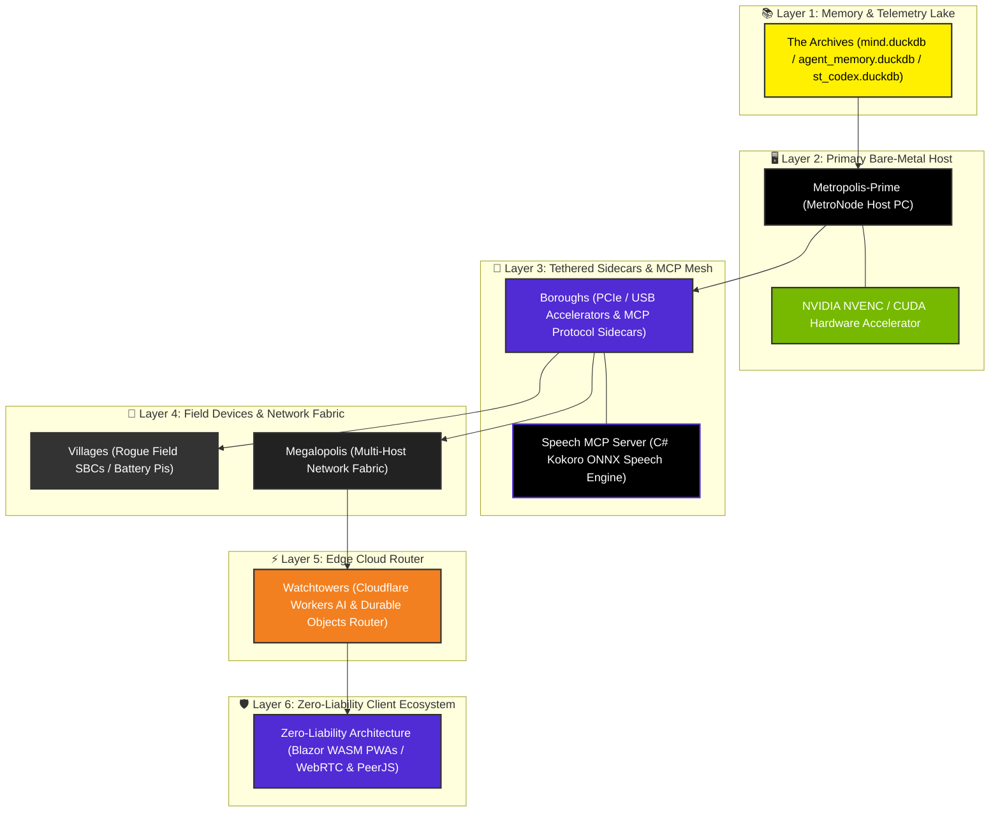

# John Dondlinger
### Systems Architect | Cloud-Native C# & Edge Engineer | Creator of Metropolis & ZLA

<p align="center">
  
</p>

<p align="center">
  <a href="https://dotnet.microsoft.com/"></a>
  <a href="https://github.com/yavru421/speech-mcp-server"></a>
  <a href="https://workers.cloudflare.com/"></a>
  <a href="https://duckdb.org/"></a>
  <a href="https://www.rust-lang.org/"></a>
  <a href="https://developer.nvidia.com/cuda-zone"></a>
</p>

---

## ⚡ Metropolis Infrastructure Topology Map (Bottom-to-Top)



---

## 🏛️ Metropolis Canonical Infrastructure Breakdown

<details open>
<summary><b>🏛️ Metropolis Infrastructure Entities (Click to Collapse)</b></summary>

<br />

| Canonical Metropolis Entity | Classification | System Role & Hardware/Software Bounds |
| :--- | :--- | :--- |
| **`Metropolis-Prime` / `MetroNode`** | Primary Host PC | High-throughput local compute host, NVENC video encoding (1080p60), and orchestrator kernel. |
| **`Boroughs`** | Tethered Sidecars | Attached PCIe cards, USB accelerators, and local MCP sidecars (`workspace-execution`, `speech-mcp-server`, `duckdb-supercharger`, `agy-mcp`, `orchestrator-do`). |
| **`Villages`** | Field SBC Devices | Standalone, battery-powered Raspberry Pi and field SBC nodes executing edge telemetry. |
| **`Megalopolis`** | Multi-Host Fabric | Inter-node networking fabric linking `MetroNode`, `Boroughs`, `Villages`, and edge services. |
| **`Watchtowers`** | Cloudflare Edge Router | Edge routing layer using Cloudflare Workers, **Durable Objects (DO)**, and Workers AI (<35ms latency). |
| **`The Archives`** | Memory & Telemetry Lake | Single-source-of-truth DuckDB telemetry lake (`mind.duckdb`, `agent_memory.duckdb`, `st_codex.duckdb`). |

</details>

<details open>
<summary><b>🛡️ Zero-Liability Architecture (ZLA) Specification (Click to Collapse)</b></summary>

<br />

*Client-side execution and peer-to-peer data transport with zero central server storage exposure.*
- **WebRTC & PeerJS Transport**: Direct peer-to-peer data channels for real-time state sync without server-side database footprint.
- **Local-First PWA Stack**: Installable Blazor WebAssembly PWAs backed by IndexedDB storage, WebSockets, and Windows DPAPI client secrets vaults.

</details>

---

## ⚙️ Native Systems & Low-Latency Engines (Open-Source)

| Engine / Component | Architecture / API | Telemetry & Latency | Source Repository |
| :--- | :--- | :--- | :--- |
| **`win32-process-array-dispatcher`** | Win32 `CreateProcessW` / C# P-Invoke | **$4.2\text{ ms}$** process spawn (vs $142\text{ ms}$ PowerShell) | [](https://github.com/yavru421/win32-process-array-dispatcher) |
| **`dxgi-cuda-frame-delta`** | Direct3D 11 DXGI + CUDA `sm_89` (AD107) | **$0.68\text{ ms}$** per 4K frame (**$1,470\text{ FPS}$**) | [](https://github.com/yavru421/dxgi-cuda-frame-delta) |
| **`speech-mcp-server`** | C# .NET 10 / Kokoro ONNX / WASAPI | **$<100\text{ ms}$** startup, 48kHz neural voice | [](https://github.com/yavru421/speech-mcp-server) |
| **`METRO-SPEC-2026.08-REV1`** | Host Whitepaper & Distributed Consensus | Production Architecture Specification | [](https://dondlingergc.com/architecture) |

---

## 🚀 Live Production Portfolio & Featured Projects (`dondlingergc.com`)

| Production Service / Repo | Live Endpoint / Repository | Status Badge & Highlights |
| :--- | :--- | :--- |
| **Architecture Specification** | [dondlingergc.com/architecture](https://dondlingergc.com/architecture) | [](https://dondlingergc.com/architecture) Systems Whitepaper & Trace |
| **Speech MCP Server** | [github.com/yavru421/speech-mcp-server](https://github.com/yavru421/speech-mcp-server) | [](https://github.com/yavru421/speech-mcp-server) Zero-Latency Neural TTS MCP Engine |
| **TAP Client** | [tap.dondlingergc.com](https://tap.dondlingergc.com) | [](https://tap.dondlingergc.com) Enterprise Control Panel |
| **Personalization Engine** | [personalization.dondlingergc.com](https://personalization.dondlingergc.com) | [](https://personalization.dondlingergc.com) Metropolis System Bridge |
| **Skydrop File Transfer** | [skydrop.dondlingergc.com](https://skydrop.dondlingergc.com) | [](https://skydrop.dondlingergc.com) Zero-Storage File Sharing |
| **Timeline ZLA Engine** | [timelinezla.dondlingergc.com](https://timelinezla.dondlingergc.com) | [](https://timelinezla.dondlingergc.com) Real-time PDF & Canvas Sync |
| **WaZ Weather Engine** | [wazweather.dondlingergc.com](https://wazweather.dondlingergc.com) | [](https://wazweather.dondlingergc.com) Weather Telemetry Engine |
| **Heckler Soundboard** | [heckler.dondlingergc.com](https://heckler.dondlingergc.com) | [](https://heckler.dondlingergc.com) High-Velocity Audio Engine |

---

## 📈 System Benchmarks & Telemetry Performance

```
┌───────────────────────────────────────┬────────────────────────┬──────────────────────┐
│ Benchmark Metric                      │ Local / Edge Target    │ Verified Result      │
├───────────────────────────────────────┼────────────────────────┼──────────────────────┤
│ DXGI → CUDA Frame Delta (4K)          │ NVIDIA AD107 (SM_89)   │ 0.68ms (1,470 FPS)   │
├───────────────────────────────────────┼────────────────────────┼──────────────────────┤
│ Direct Win32 CreateProcessW Dispatch  │ Local Host (C# Native) │ 4.20ms per process   │
├───────────────────────────────────────┼────────────────────────┼──────────────────────┤
│ Kokoro Neural Audio Synthesis         │ Local C# (.NET 10)     │ <100ms startup / ONNX│
├───────────────────────────────────────┼────────────────────────┼──────────────────────┤
│ DuckDB Telemetry Event Ingestion      │ Local Host (`MetroNode`)│ >50,000 events/sec   │
├───────────────────────────────────────┼────────────────────────┼──────────────────────┤
│ Cloudflare Durable Object State Sync  │ Edge (`Watchtowers`)   │ <35ms global latency │
├───────────────────────────────────────┼────────────────────────┼──────────────────────┤
│ NVENC Hardware H.264/HEVC Render      │ NVIDIA GPU Acceleration│ 240 FPS @ 1080p      │
├───────────────────────────────────────┼────────────────────────┼──────────────────────┤
│ ZLA Peer-to-Peer Data Transfer (WebRTC│ Client-side WASM PWA   │ Zero Server Storage  │
└───────────────────────────────────────┴────────────────────────┴──────────────────────┘
```

---

## 📐 Algebraic Pipeline Theory (APT)

$$\mathcal{Y} = \mathcal{A}_n(\mathcal{A}_{n-1}(\dots \mathcal{A}_1(\mathcal{X})\dots))$$

**Algebraic Pipeline Theory (APT)** formalizes workflows as deterministic, composable sequence pipelines. Every system—from hardware-accelerated NVENC video processing to multi-node LLM sidecar orchestration—is engineered as pure, measurable transform functions.

---

## 🛠️ Technology Belt

```
┌─────────────────┬─────────────────────────────────────────────────────────────────┐
│ Core Stack      │ C# (.NET 9/10), C++ / CUDA (sm_89), Rust, TypeScript, DuckDB    │
├─────────────────┼─────────────────────────────────────────────────────────────────┤
│ Edge Computing  │ Cloudflare Workers, Durable Objects (DO), D1, KV, Vectorize, R2 │
├─────────────────┼─────────────────────────────────────────────────────────────────┤
│ Frontend & PWA  │ Blazor WebAssembly (WASM), MudBlazor, ASP.NET Core, HTML5/CSS3  │
├─────────────────┼─────────────────────────────────────────────────────────────────┤
│ AI & Telemetry  │ Agentic MCP Sidecars, Kokoro ONNX, DuckDB Analytics, C-ABI FFI  │
├─────────────────┼─────────────────────────────────────────────────────────────────┤
│ Acceleration    │ Direct3D 11 / DXGI, CUDA Warp Shuffles, FFmpeg, NVENC, NPP      │
└─────────────────┴─────────────────────────────────────────────────────────────────┘
```

---

## 📊 Core Principles & Mindset

> *"Measure twice, formalize once."*

- **Mechanical Realism**: Hardware capabilities, OS boundaries, and memory limitations dictate architecture—no theoretical software loops.
- **Zero Fluff Delivery**: Production-ready code, explicit schema contracts, and verifiable telemetry.

---

## 💼 Contact & Engineering Inquiries

- **Architecture Whitepaper**: [dondlingergc.com/architecture](https://dondlingergc.com/architecture)
- **Portfolio & Live Demos**: [dondlingergc.com](https://dondlingergc.com)
- **GitHub Profile**: [github.com/yavru421](https://github.com/yavru421)
