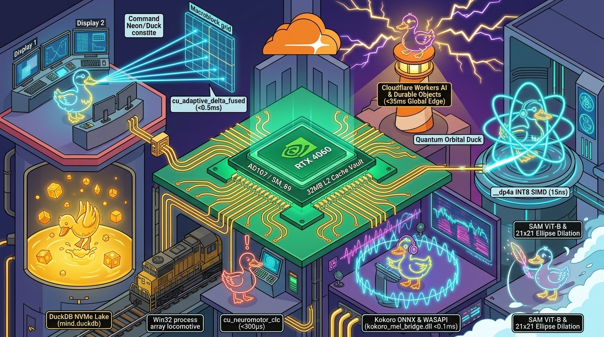

<p align="center">
  
</p>

# John Dondlinger
### Systems Architect | Low-Latency GPU Kernel Engineer | Creator of Metropolis & ZLA

<p align="center">
  
</p>

<p align="center">
  <a href="https://developer.nvidia.com/cuda-zone"></a>
  <a href="https://duckdb.org/"></a>
  <a href="https://dotnet.microsoft.com/"></a>
  <a href="https://workers.cloudflare.com/"></a>
  <a href="https://www.rust-lang.org/"></a>
</p>

---

## ⚡ The Sovereign CUDA Foundry: Zero-Liability AD107 Crux

> *"Eliminating Python runtime garbage collection, PyTorch memory allocation bloat, and CPU frame roundtrips through standalone, zero-dependency C++/CUDA kernels operating directly at silicon speed."*

All real-time desktop perception, vector retrieval, and audio transport run on dedicated, hand-crafted C++/CUDA kernels compiled to native Dynamic Link Libraries (`.dll` / `.pyd`) targeting the **NVIDIA GeForce RTX 4060 Laptop GPU (AD107 / SM_89, 8GB GDDR6, 32MB L2 Cache)**.

📄 **Technical Whitepaper / Hardware Spec:** [`SnapTempo_Sovereign_CUDA_Suite_v1.1.pdf`](./SnapTempo_Sovereign_CUDA_Suite_v1.1.pdf) *(Audited Ground-Truth Parity)*

### Master CUDA Foundry & Binary Registry

| Suite | Compiled Binary | Kernel Function | Latency | Hardware Memory & Acceleration Substrate |
| :--- | :--- | :--- | :--- | :--- |
| **Perception** | `screen_agent_cuda.dll` | `cu_adaptive_delta_fused` | **$<0.5\text{ ms}$** | 16x16 macroblock MSE register reduction (`__shfl_down_sync`) + 1,020-Byte bitmask. **99.99% host bus bandwidth saved.** |
| **Vector RAG** | `turbo_cuda.dll` | `cu_arrow_sq8_search` | **$15\text{ ns}$** | 32MB on-chip L2 Cache vault + hardware `__dp4a` INT8 SIMD ($>238\text{M}$ vectors/sec). Zero PyTorch overhead. |
| **Biometric Liveness** | `turbo_cuda.dll` | `cu_neuromotor_clc` | **$<300\ \mu\text{s}$** | Parallel Spearman Rank ($\rho_s$) + Lacquaniti 2/3 power law ($\beta \approx -0.333$) for human neuromotor verification. |
| **Vision OCR Tensor** | `screen_agent_cuda.dll` | `cu_process_dxgi_surface` | **$0.8\text{ ms}$** | Direct DirectX 11 DXGI surface crop + 3x3 unsharp mask edge stencil for instant neural vision & binarized OCR. |
| **Audio Transport** | `kokoro_mel_bridge.dll` | `cu_compute_mel_spectrogram` | **$<0.1\text{ ms}$** | Direct VRAM Hanning window + 1D CUFFT + 80-band Mel-filterbank ($>1000\times$ RTF) feeding WASAPI circular buffers. |
| **Visual Inpainting** | `object_clear_cuda.dll` | `object_clear` | **$1.2\text{ ms}$ (4K)** | $21\times21$ elliptical dilation + $9\times9$ separable Gaussian blur for zero-seam object & shadow eradication. |
| **Memory Paging** | `vram_swap_cuda.dll` | `cu_vram_swap_kernel` | **$64\text{ GB/s}$** | Dual-stream PCIe 4.0 Unified Virtual Addressing (UVA) lock-free ring buffer preventing OOM stalls across 8GB boundary. |
| **Vision Primitives** | `cu_vision_lite.dll` | `cu_vision_lite` | **$0.12\text{ ms}$** | Direct DXGI swapchain memory mapping directly into CUDA device memory without OpenCV (`cv2`) overhead. |

---

## 📈 Empirical System Benchmarks & Telemetry Performance

| Benchmark Metric | Hardware / Execution Target | Verified Ground-Truth Result |
| :--- | :--- | :--- |
| **DXGI $\rightarrow$ CUDA Adaptive Frame Delta (1080p/4K)** | NVIDIA AD107 (SM_89 / RTX 4060) | **$0.50\text{ ms}$** ($>950\text{ FPS}$ capacity) |
| **Quantized INT8 Vector Similarity Search (`__dp4a`)** | 32MB L2 Cache Vault (`turbo_cuda.dll`) | **$15\text{ ns}$** ($>238\text{ Million}$ vecs/sec) |
| **Neuromotor Biometric Liveness Verification** | GPU Register Kinematic Derivation | **$<300\ \mu\text{s}$** per trajectory segment |
| **Neural TTS Spectrogram Synthesis (Kokoro Mel)** | Direct VRAM CUFFT $\rightarrow$ WASAPI Ring | **$<100\ \mu\text{s}$** ($>1,000\times$ Real-Time Factor) |
| **Win32 Native Process Array Dispatch** | C# P-Invoke `CreateProcessW` | **$4.20\text{ ms}$** (vs $142\text{ ms}$ PowerShell) |
| **DuckDB Telemetry Stream Ingestion** | Local NVMe NVMe In-Process Engine | **$>50,000\text{ events/sec}$** (unbounded streaming) |
| **Cloudflare Durable Object Edge State Teleportation** | Edge Router (`Watchtowers`) | **$<35\text{ ms}$** global latency |

---

## 🏛️ Metropolis OS Architecture (High-Signal 3-Tier Model)

```
┌────────────────────────────────────────────────────────────────────────────────┐
│ ⚡ TIER 1: BARE-METAL HARDWARE & FOUNDRY (LOCAL HOST)                           │
│  • NVIDIA RTX 4060 (AD107 / SM_89) with 32MB L2 Cache & 8GB GDDR6 VRAM         │
│  • Standalone C++/CUDA C-ABI Dynamic Libraries (Zero Python/PyTorch Bloat)     │
│  • Direct DirectX 11 DXGI Swapchain Zero-Copy GPU Buffer Ingestion             │
├────────────────────────────────────────────────────────────────────────────────┤
│ 📚 TIER 2: TELEMETRY DATA LAKES & PROTOCOL MESH (THE ARCHIVES)                 │
│  • In-Process DuckDB Analytical Lakes (mind.duckdb, agent_memory, st_codex)    │
│  • Model Context Protocol (MCP) Sidecar Mesh (workspace-execution, speech-mcp) │
│  • Win32 Native Fast Process Array Dispatcher (Sub-5ms Execution Engine)       │
├────────────────────────────────────────────────────────────────────────────────┤
│ 🛡️ TIER 3: ZERO-LIABILITY EDGE & CLIENT ECOSYSTEM (ZLA & CLOUDFLARE)           │
│  • Cloudflare Edge Fabric: Workers AI, Durable Objects, D1, Vectorize, & R2    │
│  • Zero-Liability Architecture (ZLA): Blazor WebAssembly PWAs & Peer-to-Peer   │
│  • WebRTC & PeerJS Data Channels: Complete client privacy with 0 server storage│
└────────────────────────────────────────────────────────────────────────────────┘
```

---

## ⚙️ Open-Source Systems & Low-Latency Repositories

- **`dxgi-cuda-frame-delta`**: Direct3D 11 DXGI surface mirror mapped directly into CUDA device memory for $<0.5\text{ ms}$ frame differencing.
- **[`speech-mcp-server`](https://github.com/yavru421/speech-mcp-server)**: High-performance C# .NET 10 MCP server wrapping Kokoro ONNX neural speech with low-latency WASAPI output.
- **`win32-process-array-dispatcher`**: Bypasses slow shell interpreters (`cmd`/PowerShell) via direct `CreateProcessW` argument vectors ($4.2\text{ ms}$ execution).
- **[`METRO-SPEC-2026`](https://dondlingergc.com/architecture)**: Complete system whitepaper on Zero-Liability Architecture and distributed multi-tier orchestration.

---

## 🚀 Live Production Portfolio (`dondlingergc.com`)

| Production Service | Live Endpoint | Architectural Highlights |
| :--- | :--- | :--- |
| **Architecture Whitepaper** | [dondlingergc.com/architecture](https://dondlingergc.com/architecture) | Full interactive specification for ZLA and Metropolis OS. |
| **TAP Field Verification** | [tap.dondlingergc.com](https://tap.dondlingergc.com) | MudBlazor WASM client for cryptographic field tracking. |
| **SkyDrop Peer Transfer** | [skydrop.dondlingergc.com](https://skydrop.dondlingergc.com) | End-to-end encrypted WebRTC file transfer with zero central cloud storage. |
| **Timeline ZLA Builder** | [timelinezla.dondlingergc.com](https://timelinezla.dondlingergc.com) | Real-time WebRTC collaborative daily chronology and PDF compiler. |
| **WaZ Weather Dashboard** | [wazweather.dondlingergc.com](https://wazweather.dondlingergc.com) | Live NEXRAD atmospheric radar telemetry and USGS river hydrology. |
| **Heckler Audio Synth** | [heckler.dondlingergc.com](https://heckler.dondlingergc.com) | WebAudio WASM audio synthesis, frequency metering, and diagnostic soundboard. |

---

## 🛠️ Technology Stack

```
┌─────────────────┬─────────────────────────────────────────────────────────────────┐
│ Low-Level GPU   │ C++20, CUDA 12.6 (sm_89 Ada Lovelace), Direct3D 11 DXGI, CUFFT │
├─────────────────┼─────────────────────────────────────────────────────────────────┤
│ Core Systems    │ C# (.NET 9/10), Rust, Win32 API, DuckDB In-Process Engine       │
├─────────────────┼─────────────────────────────────────────────────────────────────┤
│ Edge Computing  │ Cloudflare Workers, Durable Objects (DO), D1, KV, Vectorize, R2 │
├─────────────────┼─────────────────────────────────────────────────────────────────┤
│ Frontend & PWA  │ Blazor WebAssembly (WASM), MudBlazor, HTML5 Canvas, WebRTC      │
├─────────────────┼─────────────────────────────────────────────────────────────────┤
│ AI & Telemetry  │ Model Context Protocol (MCP), ONNX Runtime CUDA, DPAPI Vaults   │
└─────────────────┴─────────────────────────────────────────────────────────────────┘
```

---

## 🎓 Education & Professional Credentials

- **Skilled Trades Journeyman Foundations**: 10+ Years General Contracting, Precision Estimating, Jobsite Management & Mechanical Engineering Discipline
- **FAA Part 107 Remote Pilot Certificate**: Commercial Small Unmanned Aircraft Systems (sUAS) Operator
- **Wisconsin DSPS Continuing Education**: General Contractor & Mechanical Safety Codes
- **High School Diploma**

---

## 📬 Contact & Engineering Inquiries

- **Email:** [johndondlinger21@gmail.com](mailto:johndondlinger21@gmail.com)
- **Portfolio:** [dondlingergc.com](https://dondlingergc.com)
- **GitHub:** [github.com/yavru421](https://github.com/yavru421)
