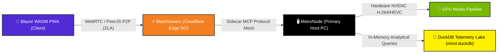

# John Dondlinger
### Systems Architect | Cloud-Native C# & Edge Engineer | Creator of Metropolis & ZLA

<p align="center">
  
</p>

<p align="center">
  <a href="https://dotnet.microsoft.com/"></a>
  <a href="https://dotnet.microsoft.com/apps/aspnet/web-apps/blazor"></a>
  <a href="https://workers.cloudflare.com/"></a>
  <a href="https://duckdb.org/"></a>
  <a href="https://www.rust-lang.org/"></a>
  <a href="https://developer.nvidia.com/cuda-zone"></a>
</p>

---

## ⚡ System Execution Architecture



---

## 🏛️ Core Flagship Architectures

<details open>
<summary><b>🏛️ Metropolis Distributed Infrastructure (Click to Collapse)</b></summary>

<br />

*A hybrid local-to-edge agent execution framework and real-time telemetry lake.*
- **Primary Host PC (`MetroNode`)**: Coordinates high-throughput local compute, hardware NVENC video processing (1080p60 H.264/HEVC), and local DuckDB memory stores (`mind.duckdb`).
- **Cloudflare Edge (`Watchtowers`)**: Smart edge routing layer powered by Cloudflare Workers, **Durable Objects (DO)**, and Workers AI for low-latency state synchronization (<35ms) and token-efficient cognitive offloading.
- **Sidecar MCP Mesh**: Dedicated protocol adapters for real-time telemetry, filesystem mutation, and DuckDB analytical queries.

</details>

<details open>
<summary><b>🛡️ Zero-Liability Architecture (ZLA) Specification (Click to Collapse)</b></summary>

<br />

*Client-side execution and peer-to-peer data transport with zero central server storage exposure.*
- **WebRTC & PeerJS Transport**: Direct peer-to-peer data channels for real-time state sync without server-side database footprint.
- **Local-First PWA Stack**: Installable Blazor WebAssembly PWAs backed by IndexedDB storage, WebSockets, and Windows DPAPI client secrets vaults.

</details>

---

## 🚀 Live Production Portfolio & Interactive Demos (`dondlingergc.com`)

| Production Service | Live Endpoint | Status Badge & Highlights |
| :--- | :--- | :--- |
| **TAP Client** | [tap.dondlingergc.com](https://tap.dondlingergc.com) | [](https://tap.dondlingergc.com) Enterprise Control Panel |
| **Personalization Engine** | [personalization.dondlingergc.com](https://personalization.dondlingergc.com) | [](https://personalization.dondlingergc.com) Metropolis System Bridge |
| **Skydrop File Transfer** | [skydrop.dondlingergc.com](https://skydrop.dondlingergc.com) | [](https://skydrop.dondlingergc.com) Zero-Storage File Sharing |
| **Timeline ZLA Engine** | [timelinezla.dondlingergc.com](https://timelinezla.dondlingergc.com) | [](https://timelinezla.dondlingergc.com) Real-time PDF & Canvas Sync |
| **WaZ Weather Engine** | [wazweather.dondlingergc.com](https://wazweather.dondlingergc.com) | [](https://wazweather.dondlingergc.com) Weather Telemetry Engine |
| **Heckler Soundboard** | [heckler.dondlingergc.com](https://heckler.dondlingergc.com) | [](https://heckler.dondlingergc.com) High-Velocity Audio Engine |

---

## 📈 System Benchmarks & Telemetry Performance

```
┌───────────────────────────────────────┬────────────────────────┬──────────────────────┐
│ Benchmark Metric                      │ Local / Edge Target    │ Verified Result      │
├───────────────────────────────────────┼────────────────────────┼──────────────────────┤
│ DuckDB Telemetry Event Ingestion     │ Local Host (`MetroNode`)│ >50,000 events/sec   │
├───────────────────────────────────────┼────────────────────────┼──────────────────────┤
│ Cloudflare Durable Object State Sync  │ Edge (`Watchtowers`)   │ <35ms global latency │
├───────────────────────────────────────┼────────────────────────┼──────────────────────┤
│ NVENC Hardware H.264/HEVC Render      │ NVIDIA GPU Acceleration│ 240 FPS @ 1080p      │
├───────────────────────────────────────┼────────────────────────┼──────────────────────┤
│ ZLA Peer-to-Peer Data Transfer (WebRTC│ Client-side WASM PWA   │ Zero Server Storage  │
└───────────────────────────────────────┴────────────────────────┴──────────────────────┘
```

---

## 🔬 Edge-Cellular Execution Visualizer (Mitosis & Meiosis)

<details>
<summary><b>🧬 Edge-Cellular Subagent Mesh Spec (Click to Expand)</b></summary>

<br />

```
                       ┌──────────────────────────────────────────────┐
                       │   [Root Prompt / Architecture Input]         │
                       └──────────────────────┬───────────────────────┘
                                              │
                                   (Tier 1: Edge Mitosis)
            ┌─────────────────────────────────┼─────────────────────────────────┐
            ▼                                 ▼                                 ▼
   [Micro-Cell 1: ZLA Specs]         [Micro-Cell 2: MetroNode]        [Micro-Cell 3: Cloudflare DO]
   (@cf/meta/llama-3.2-3b)           (@cf/meta/llama-3.2-3b)          (@cf/meta/llama-3.2-3b)
            │                                 │                                 │
            └─────────────────────────────────┼─────────────────────────────────┘
                                              │
                                   (Tier 2: Meiosis Synthesis)
                                              ▼
                                 [Cloudflare Edge Router]
                             (@cf/meta/llama-3.3-70b-instruct)
                                              │
                                              ▼
                             [Verified Telemetry & Production]
```

</details>

---

## 📐 Algebraic Pipeline Theory (APT)

$$\mathcal{Y} = \mathcal{A}_n(\mathcal{A}_{n-1}(\dots \mathcal{A}_1(\mathcal{X})\dots))$$

**Algebraic Pipeline Theory (APT)** formalizes workflows as deterministic, composable sequence pipelines. Every system—from hardware-accelerated NVENC video processing to multi-node LLM sidecar orchestration—is engineered as pure, measurable transform functions.

---

## 🛠️ Technology Belt

```
┌─────────────────┬─────────────────────────────────────────────────────────────────┐
│ Core Stack      │ C# (.NET 8/9), Rust, TypeScript, Python, SQL (DuckDB/SQLite)    │
├─────────────────┼─────────────────────────────────────────────────────────────────┤
│ Edge Computing  │ Cloudflare Workers, Durable Objects (DO), D1, KV, Vectorize, R2 │
├─────────────────┼─────────────────────────────────────────────────────────────────┤
│ Frontend & PWA  │ Blazor WebAssembly (WASM), MudBlazor, ASP.NET Core, HTML5/CSS3  │
├─────────────────┼─────────────────────────────────────────────────────────────────┤
│ AI & Telemetry  │ Agentic MCP Sidecars, DuckDB Analytics, PyTorch CUDA, OpenCV    │
├─────────────────┼─────────────────────────────────────────────────────────────────┤
│ Acceleration    │ FFmpeg, NVENC, NPP, OpenCL, Parametric OpenSCAD                 │
└─────────────────┴─────────────────────────────────────────────────────────────────┘
```

---

## 📊 Core Principles & Mindset

> *"Measure twice, formalize once."*

- **Mechanical Realism**: Hardware capabilities, OS boundaries, and memory limitations dictate architecture—no theoretical software loops.
- **Zero Fluff Delivery**: Production-ready code, explicit schema contracts, and verifiable telemetry.

---

## 💼 Contact & Engineering Inquiries

- **Portfolio & Live Demos**: [dondlingergc.com](https://dondlingergc.com)
- **GitHub Profile**: [github.com/yavru421](https://github.com/yavru421)
